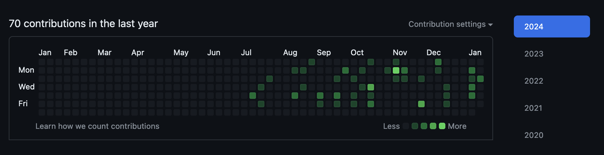
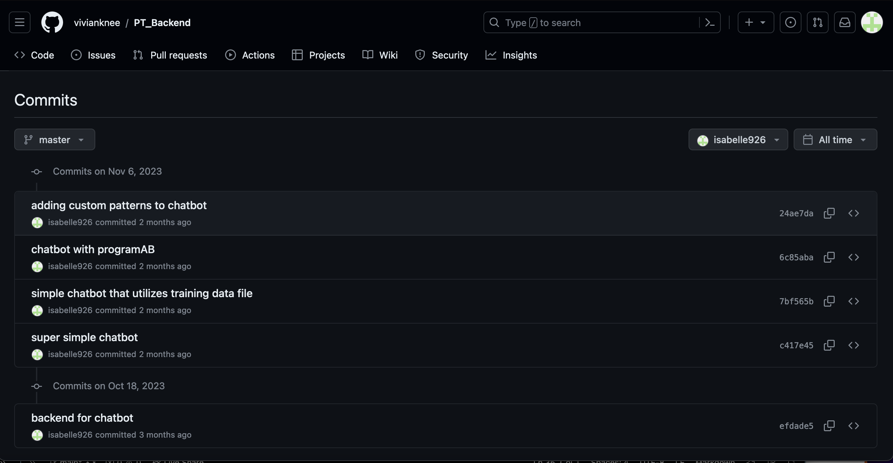

## Github Analytics

## Student Lessons
|                              | Score, Grader Verification |      Runtime     |        Extras       | Key Indicators: Blog, GitHub File(s) and Key Commits |
|------------------------------|:--------------------------:|:----------------:|:-------------------:|:----------------------------------------------------:|
| SASS hacks |0.55|[Link](https://github.com/isabelle926/isabelleTri2/blob/main/_notebooks/2023-12-05-FinalSASSLesson.ipynb)|   |[Link](https://github.com/isabelle926/isabelleTri2/commit/1a5accf11a906e315548bcfebb4ffe15a98ce8b1)|
| jQuery hacks |0.8|[Link](https://github.com/isabelle926/isabelleTri2/blob/main/_notebooks/2023-12-07-CRUD-JQUERY-HACKS.ipynb)| |[Link](https://github.com/isabelle926/isabelleTri2/commit/1a5accf11a906e315548bcfebb4ffe15a98ce8b1)|
| Thymeleaf hacks |---|                  |No lesson|    |
| SQL, HashMap hacks |0.6|[Link](https://github.com/isabelle926/isabelleTri2/blob/main/_notebooks/2023-12-13-HashmapsHashsetsCollections.ipynb)|  |[Link](https://github.com/isabelle926/isabelleTri2/commit/1a5accf11a906e315548bcfebb4ffe15a98ce8b1)|
| JWT hacks | 1/1 |---|Our group made this lesson|---|
| CORS, dotEnv, Exploits hacks | 0.7 |[Link](https://github.com/isabelle926/isabelleTri2/blob/main/_notebooks/2023-12-08-JavaExploitsStudent.ipynb)|Explained SQL inject insecurities[Link](https://github.com/isabelle926/isabelleTri2/blob/main/_notebooks/2023-12-08-JavaExploitsStudent.ipynb)|
| CB Quiz |30/39 1.55/2|[Link](https://github.com/isabelle926/isabelleTri2/commit/f6aa9dd9f4dc8dd6a1ef69dab4284dc86296c427)|   |[Link](https://github.com/isabelle926/isabelleTri2/commit/f6aa9dd9f4dc8dd6a1ef69dab4284dc86296c427)|
|   |   |   |   |   |
| Totals | Median Score: 0.7 | Number complete: 6 | Extra effort count: 1 | Key commit count: 4 |

After being taught the student lessons, I considered how I could include these in my project. In my next project, which will be about finding internships for students interested in computer science, the website that my team has planned has several different pages which are navigated to from the home page, so using SASS would create a visually pleasing theme which ties each of the pages together naturally. The project also includes login, which I would use what I learned from JWT and the CORS lessons in order to make it more secure. 

## Trimester 1 Project - Pocket Therapist

### Purpose: Create an application that can detect the mood of the users and provide responses based on that mood

My role in this project was to create an AI chatbot that would get the mood of the user and generate a response and maintain a conversation based on that mood. 

### Commits:

## Trimester 2 Project - 2584 game

### Purpose: Create a game that functions similarly to the 2048 game in order to demonstrate fibonacci numbers

My role in this project was to code a game that used fibonacci numbers instead of exponents of 2. 
