## MC Corrections

| Question Number | Original Reasoning | Revision |
| --------------- | ------------------ | -------- |
| 6. 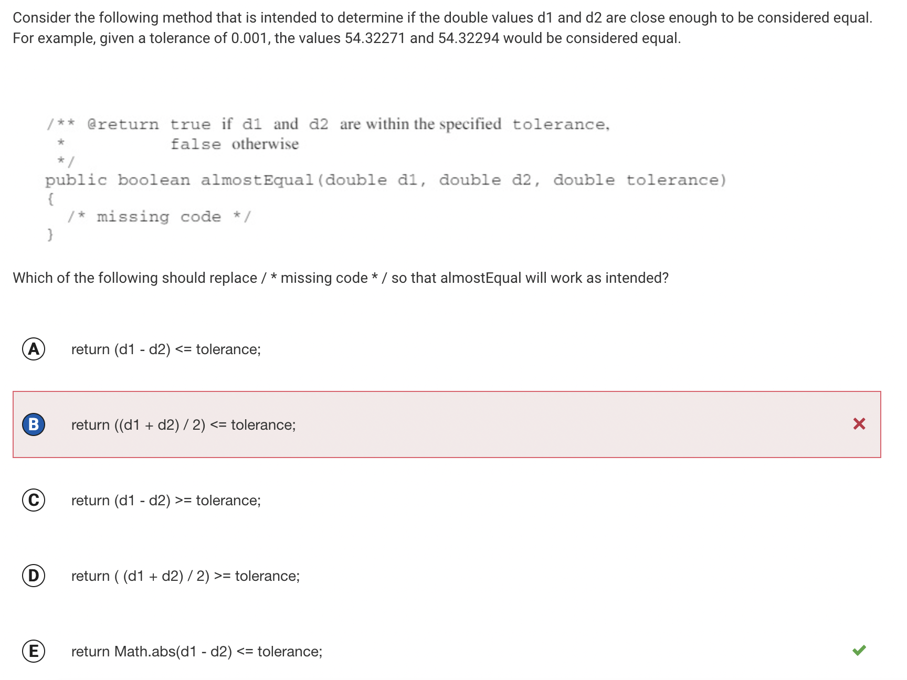 | I originally answered "B" I forgot about Math.abs | The correct answer is "E" because one of the numbers may be negative so I need to find the absolute value | 
| 10. 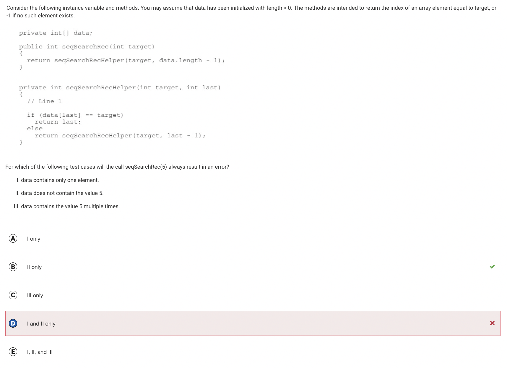 | I originally answered "D" because I did not realize that 1 would return something | The correct answer is "B" because it will cause an ArrayIndexOutOfBoundsException error to be thrown | 
| 11. 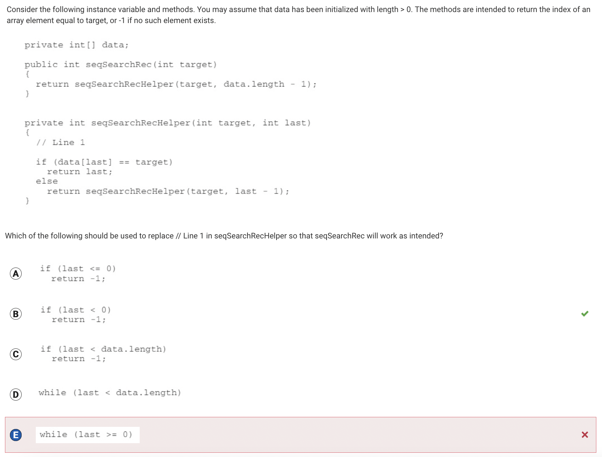 | I originally answered "E" because I guessed for this question | The correct answer is "B" because it will correctly return -1 without throwing an ArrayIndexOutOfBoundsException error | 
| 14. 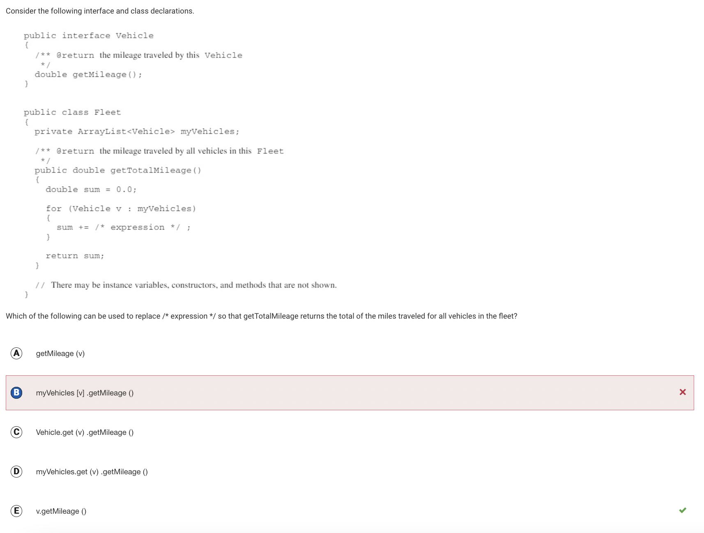 | I originally answered "B" because I thought that accessing an ArrayList would be the same as accessing an Array | The correct answer is "E" because the method uses an enhanced for loop and assigns a value to 'v', so v can be directly used | 
| 15. 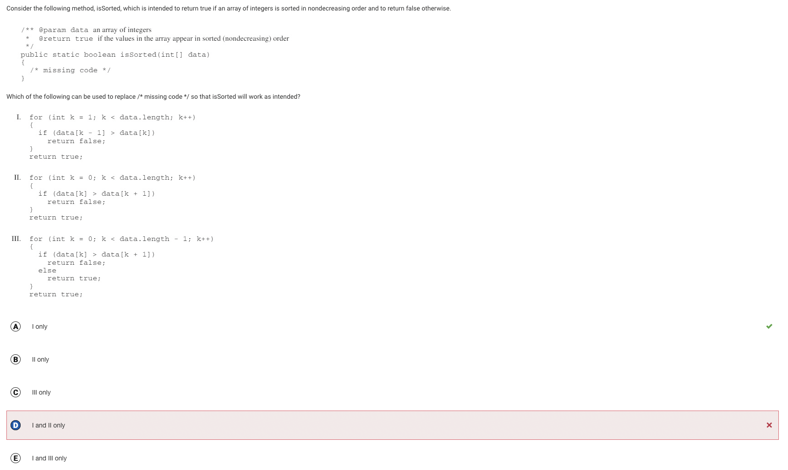 | I originally answered "D" because I did not realize that choice II was incorrect and would throw an ArrayIndexOutOfBoundsException error. | The correct answer is "A" because only choice I would examine each option | 
| 16. 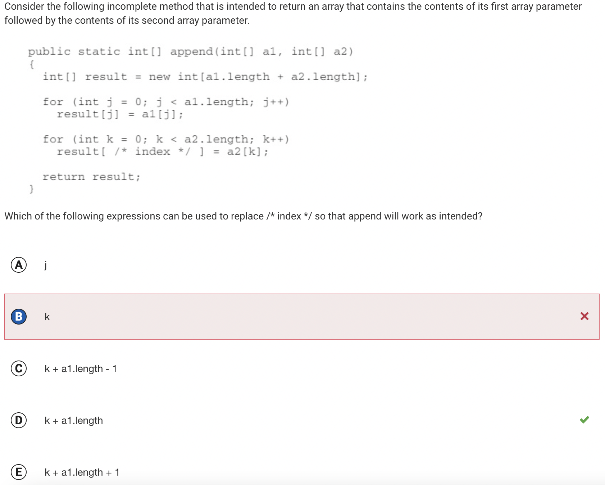 | I originally answered "B" because I did not realize that the question was trying to make a new list that combined the contents of both the first and second array parameters. For some reason, I thought that it was trying to print two lists. | The correct answer is "D" because after the first for loop runs, the elements from 0 to a1.length - 1 are all full so you must add a1.length in order to correctly add the elements from the second array. |
| 17. 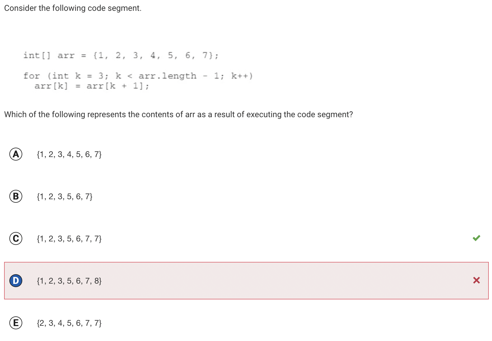 | I originally answered "D" because I thought that the for loop would also affect the last element of the array arr | The correct answer is "C" because the for loop does not add one to the last element of array arr as it only continues for k < arr.length - 1, which is one less than the total number of elements inside of the array | 
| 18. 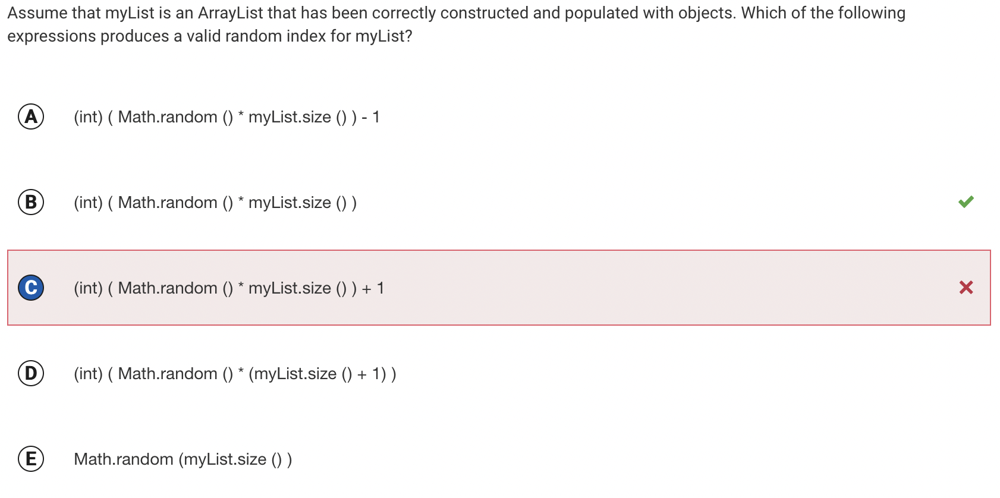 | I originally answered "C" because I thought that the correct range was between 1 and myList.size() | The correct answer is "B" because the indices for myList are from 0 through myList.size() - 1 |
| 19. 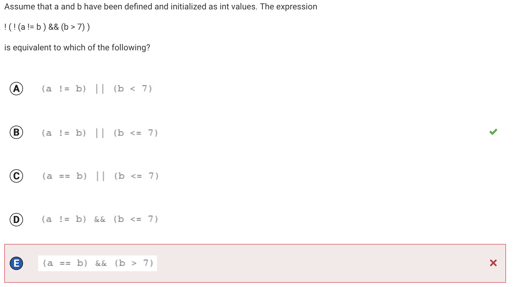 | I originally answered "E" because I thought that the expression was !(!((a!=b) && (b > 7))) | The correct answer is "B" because of De Morgan's Law. |
| 23. 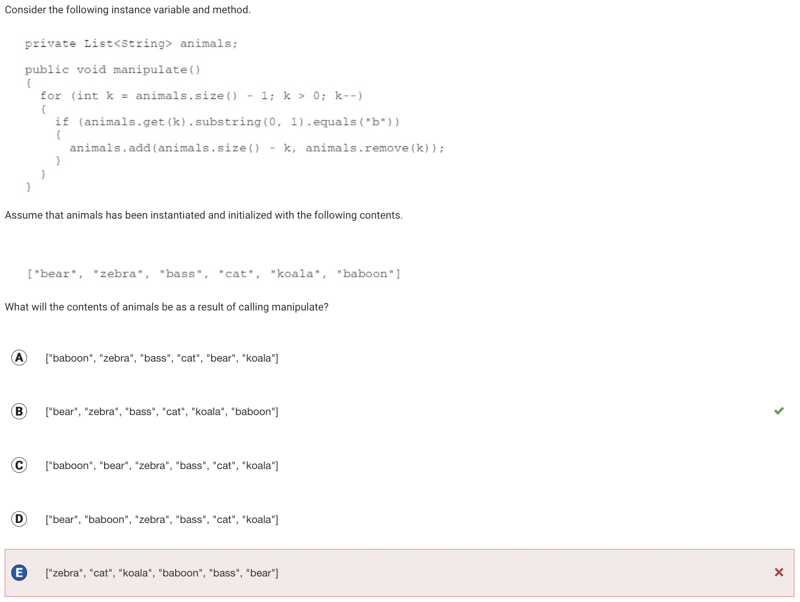 | I originally answered "E" because I guessed on this question. | The correct answer is "B". The manipulate method contains a for loop with a loop control variable k that starts at the right most index of animals, decrements by 1 each time, until k is equal to 0. In the first iteration, when k is 5, if the element of animals at 5 (“baboon”) starts with a “b”, which it does, then this value is removed from the list and inserted at index 1. The list would then be {“bear”, “baboon”, “zebra”, “bass”, “cat”, “koala”}. In the second iteration, when k is 4, the element of animals at 4 (“cat”) does not start with a “b” and no changes are made to the list. In the third iteration, when k is 3, the element of animals at 3 (“bass”) starts with a “b”. This value is removed from the list and inserted at index 3. Since it was already at index 3, the list would not change. In the fourth iteration, when k is 2, the element of animals at 2 (“zebra”) does not start with a “b” and no changes are made to the list.  In the fifth iteration, when k is 1, the element of animals at 1 (“baboon”) starts with a “b”. It is removed from the list and inserted at index 5. The list would then be {“bear”, “zebra”, “bass”, “cat”, “koala”, “baboon”}.  Finally, k decrements to 0 which is not greater than 0 so the loop terminates. | 
| 24. 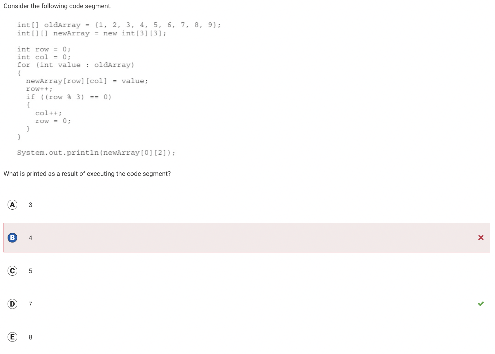 | I originally answered "B" because I forgot that the column count starts at 0, not 1, so I looked at elements in the second column instead of the third column | The correct answer is "D", because the number 7 is located in the first row and third column. |
| 25. 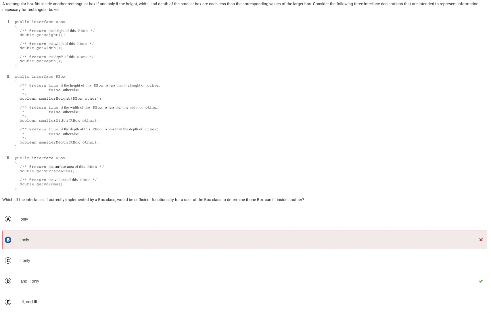 | I originally answered "B", 2 only because I did not realize that 1 and 2 served the same purpose of measuring the box's dimensions, and the only difference is that 1 simply outputs the measurements while 2 will output true if the measurements of one Box are smaller than the other. | The correct answer is "D", 1 and 2 only, for the reasons that I already stated in the previous column. | 
| 26. 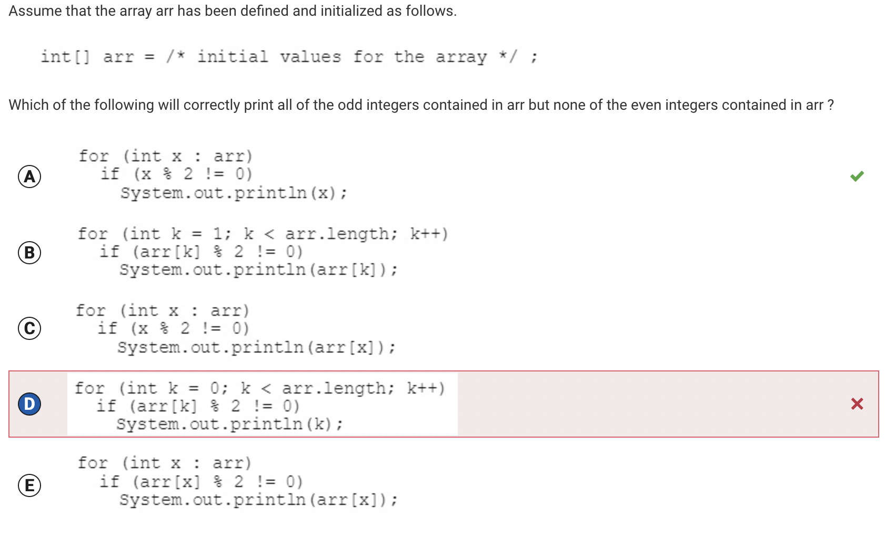 | I originally answered "D", but this is wrong because the for loop only prints the indices where odd numbers can be found. | The correct answer is "A" because the algorithm uses an enhanced for loop to assign a value x for each element in arr, and will print out the value if it is an odd number. |
| 27. 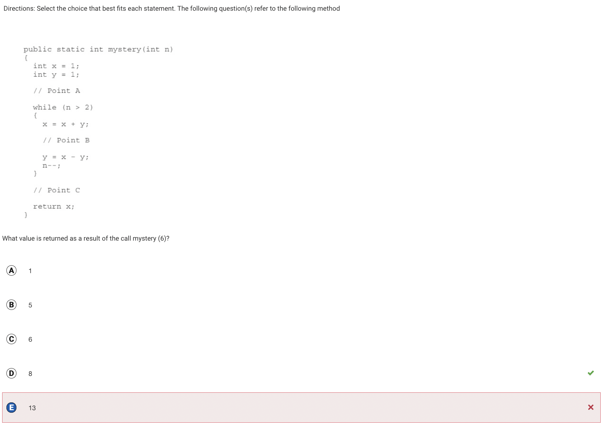 | I originally answered "E" because I misread the algorithm and thought that the loop iterated while n > = 2, not n > 2. | The correct answer is "D". In the first iteration of the while loop, n (which is 6) is greater than 2. The variable x is assigned 1 + 1 or 2. The variable y is assigned 2 – 1 or 1. The variable n is decremented by 1 and has the value 5. In the second iteration of the while loop, n is greater than 2. The variable x is assigned 2 + 1 or 3. The variable y is assigned 3 – 1 or 2. The variable n is decremented by 1 and has the value 4. In the third iteration of the while loop, n is greater than 2. The variable x is assigned 3 + 2 or 5. The variable y is assigned 5 – 2 or 3. The variable n is decremented by 1 and has the value 3. In the fourth iteration of the while loop, n is greater than 2. The variable x is assigned 5 + 3 or 8. The variable y is assigned 8 – 3 or 5. The variable n is decremented by 1 and has the value 2. At this point the while loop terminates since n is no longer greater than 2 and the value 8 is returned. |
| 29. 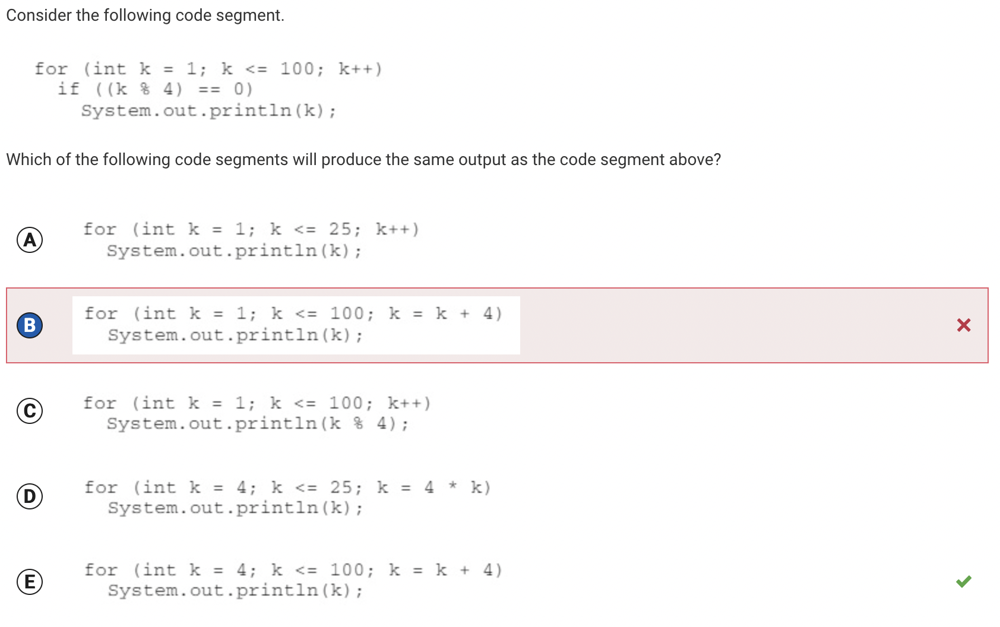 | I originally answered "B", but this is wrong because then the for loop would print 1, 5, 9, 13, 17, etc. | The correct answer is "E" because the for loop would print 4, 8, 12, 16, 20, etc. which is the same output of the other for loop | 
| 30. 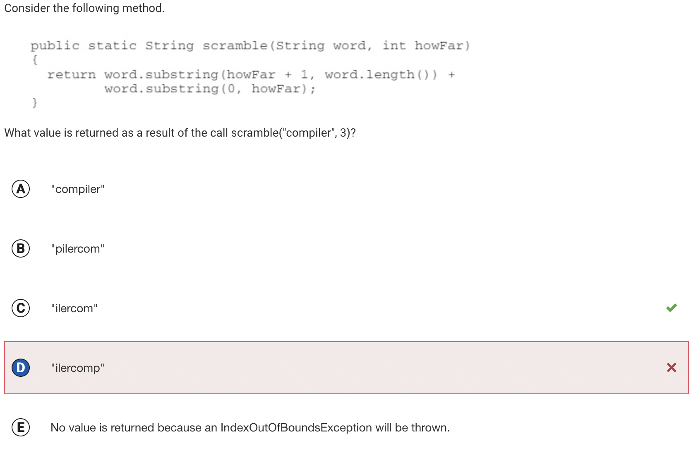 | I originally answered "D" because I thought that the returned value would have the same amount of characters as the input. | The correct answer is "C". The two parameter substring method returns the substring beginning at the first parameter and ending at the second parameter – 1. When word is assigned “compiler” and howFar is assigned 3, the value of word.substring(howFar + 1, word.length()) is “iler”. This is the substring of “compiler” beginning at 3 + 1 or 4 and ending at 8 – 1 or 7. The value of word.substring(0, howFar) is “com”. This is the substring of “compiler” beginning at 0 and ending at 2. The method returns “ilercom”. |
| 32. 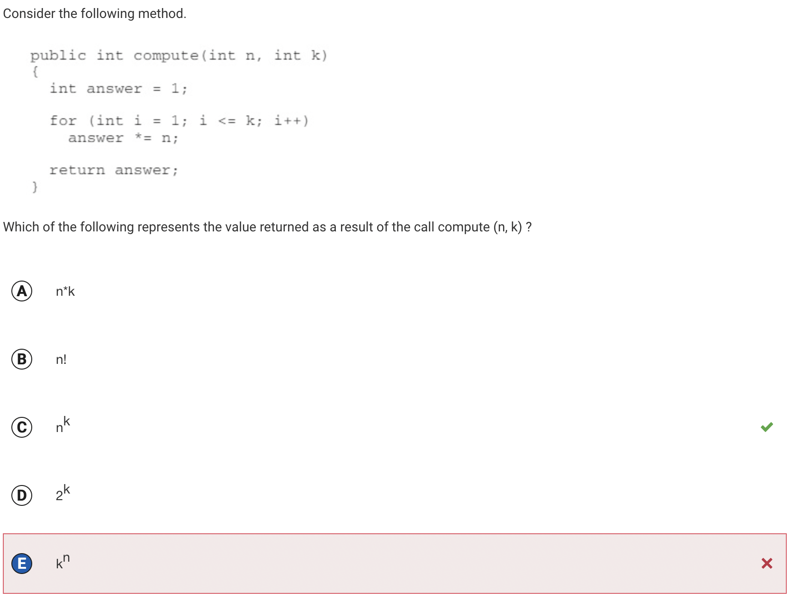 | I originally answered "E" because I mixed up whether n or k was the base or the exponent. | The correct answer is "C" because the algorithm multiplies n by itself k time, which is n^k. |
| 33. 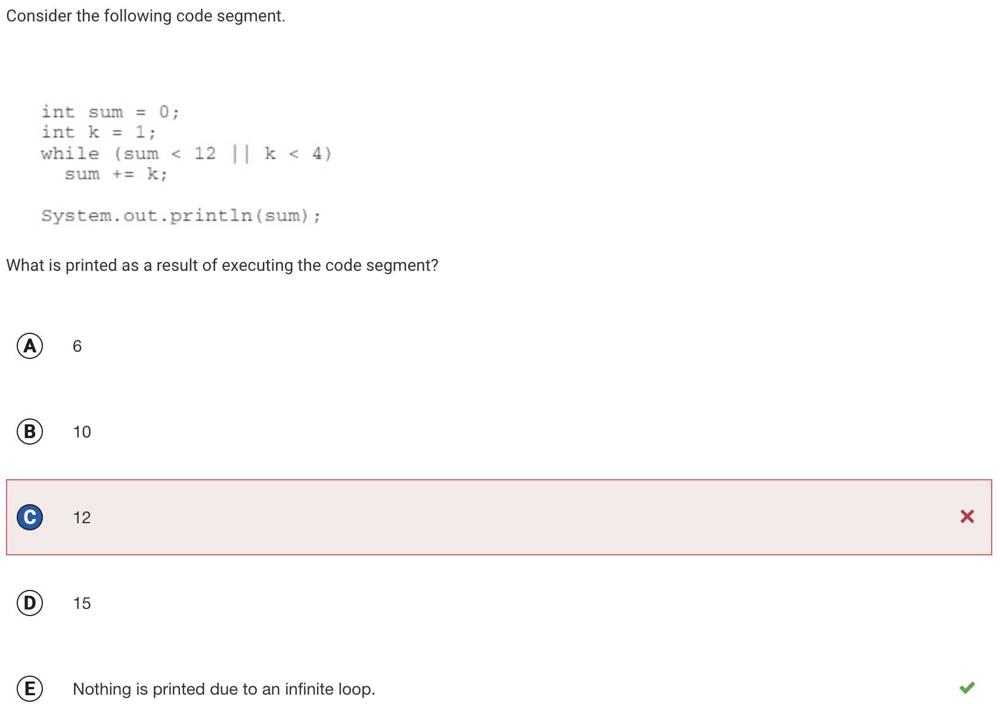 | I originally answered "C" because I did not realize that the loop was infinite because k would never be greater than 4. | The correct answer is "E" because nothing is printed out due to an infinite loop since k would always be less than 4. |
| 34. 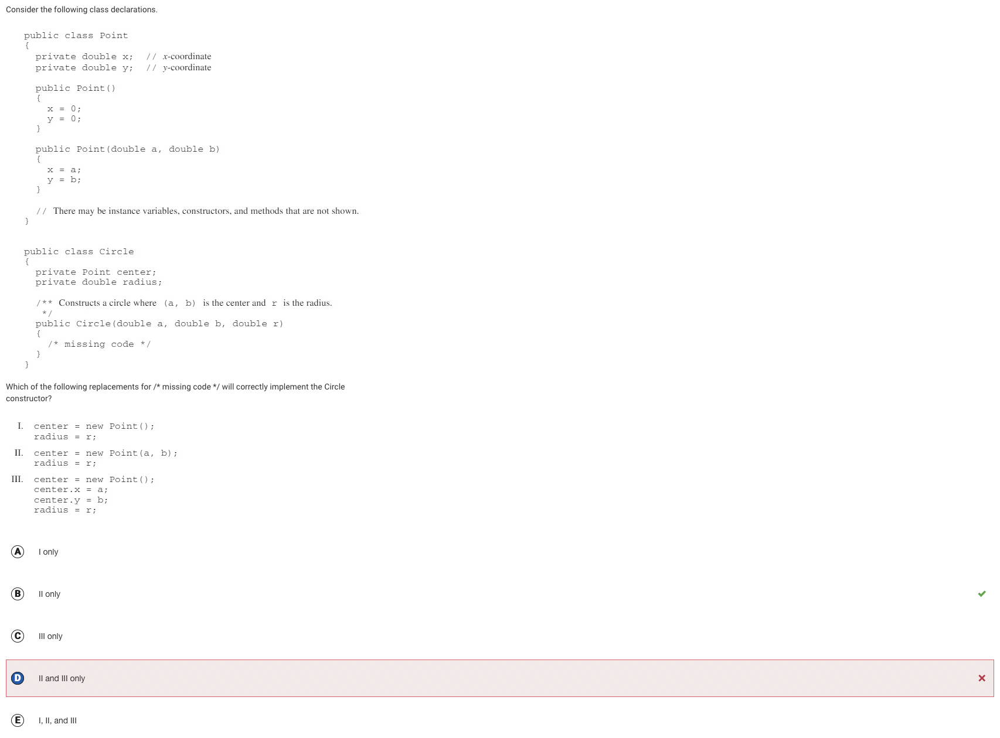 | I originally answered "D", 2 and 3 only, becuase I did not realize that 3 would not be able to compile. | The correct answer is "B", 2 only. 3 does not work because it attempts to update x and y, but this does not work because they are private instance variables. |
| 37. 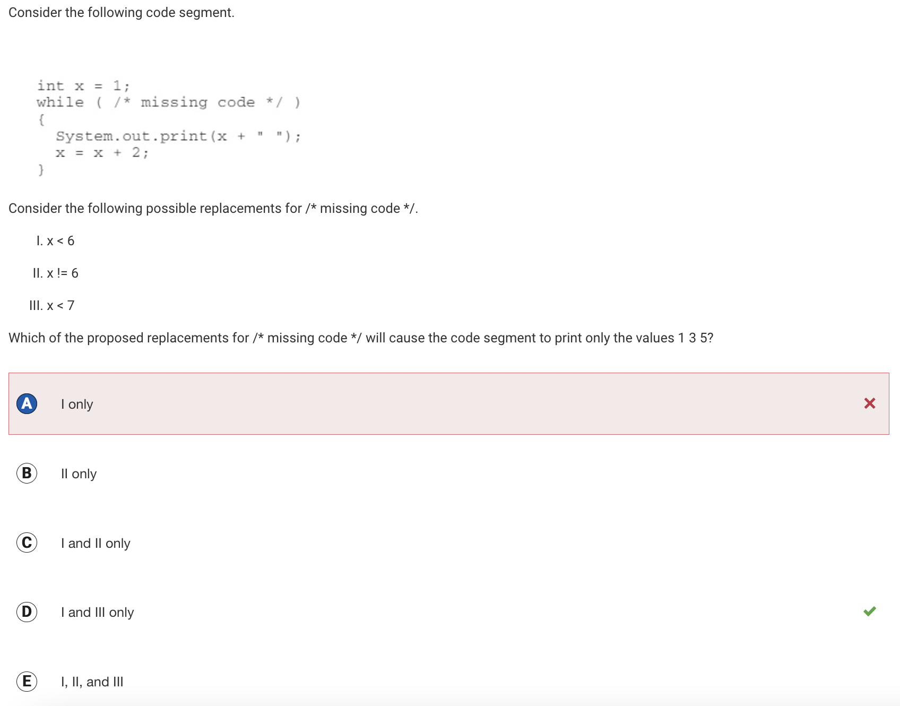 | I originally answered "A", 1 only, becuase I did not realize that 3 would also work. | The correct answer is "D", 1 and 3 only. Choice I will cause the while loop to iterate while x is less than 6. The variable x is assigned 1 to start and then incremented by 2. It will be assigned the values 1, 3, 5 and then 7. When x has the value 7, the loop will terminate. The output will be 1 3 5. Choice II will cause the while loop to iterate as long as x is not equal to 6. The variable x is assigned 1 to start and then incremented by 2. It will be assigned 1, 3, 5, 7, ... and will cause an infinite loop as it will never equal 6. Choice III will cause the while loop to iterate while x is less than 7. The variable x is assigned 1 to start and then incremented by 2. It will be assigned the values 1, 3, 5 and then 7. When x has the value 7, the loop will terminate. The output will be 1, 3, 5. |
| 38. 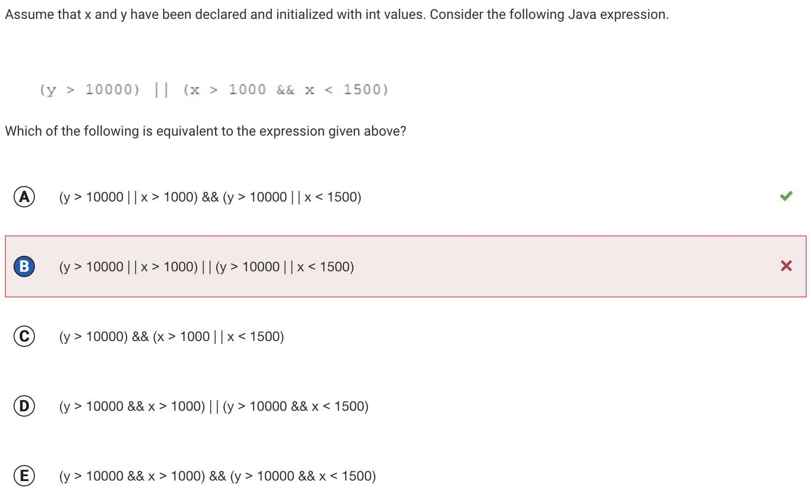 | I originally answered "B", which is wrong as this expression will always evaluate to true since x is always either greater than 1000 or less than 1500. | The correct answer is "A". The original expression evaluates to true when either y is greater than 10000 or x is between 1000 and 1500. If the value of y is greater than 10000, this equivalent expression will evaluate to true since it is used in both of the or (||) expressions. If y is not greater than 10000, the only way the equivalent expression can evaluate to true is if x is between 1000 and 1500. |
| 39. 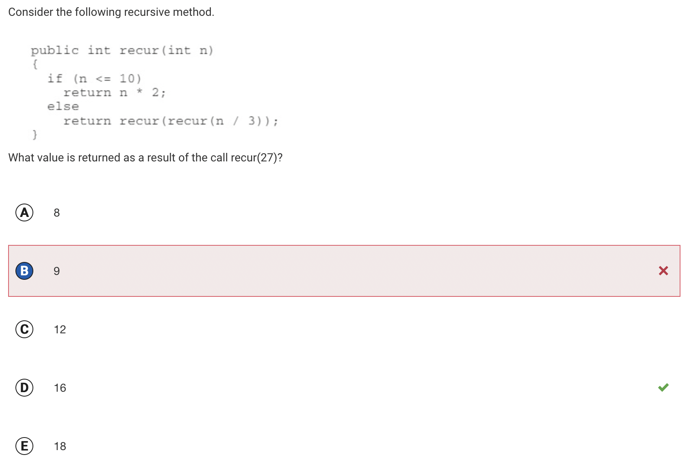 | I originally answered "B", which is incorrect because 9 is the value that is passed in the first recursive call to recur. | The correct answer is "D", 16. The call recur(27) returns the value of recur(recur(9)) since 27 is greater than 10. The call recur(9) returns 18, since 9 is less than or equal to 10. Therefore, recur(recur(9)) is recur(18). The call recur(18) returns recur(recur(6)) since 18 is greater than 10. The call recur(6) returns 12, since 6 is less than or equal to 10. Therefore, recur(recur(6)) is recur(12). The call recur(12) returns recur(recur(4)) since 12 is greater than 10. The call recur(4) returns 8, since 4 is less than or equal to 10. Therefore, recur(recur(4)) is recur(8). The call recur(8) returns 16, since 8 is less than or equal to 10.  Therefore, recur(27)returns the value of 16. |
| 40.  | I originally answered "D", which is incorrect because when whatsItDo(“W”) is called, nothing is printed since the print occurs in the if statement which does not execute. All previous recursive method calls print a substring of str and not str. | The correct answer is "C". The call whatsItDo(“WATCH”) assigns to temp a substring of “WATCH” starting at 0 and ending at 4 – 1 or 3, which is “WATC”. Next the call whatsItDo(“WATC”) is made. The call whatsItDo(“WATC”), sets its local temp to “WAT” and calls whatsItDo(“WAT”). The call whatsItDo(“WAT”), sets its local temp to “WA” and calls whatsItDo(“WA”). The call whatsItDo(“WA”), sets its local temp to “W” and calls whatsItDo(“W”). The call whatsItDo(“W”) reaches the base case and doesn’t do anything since the length of “W” is 1. Then we need to finish the call to whatsItDo(“WA”), which prints the value of its local temp, “W”.  Then we need to finish the call to whatsItDo(“WAT”), which prints the value of its local temp, “WA”. Then we need to finish the call to whatsItDo(“WATC”), which prints the value of its local temp, “WAT”. Then we need to finish the call to whatsItDo(“WATCH”), which prints the value of its local temp, “WATC”. And the recursive calls are complete. |